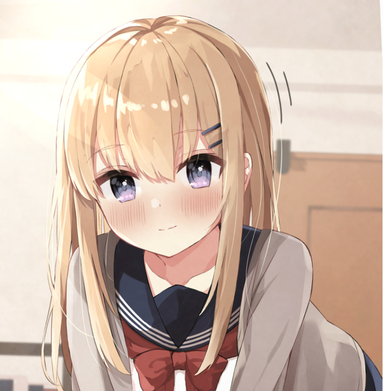

# 形象设定

## 发型

过肩长发，额头中心位置刘海，右侧头发上面别一个发卡，发卡的图案可以考虑logo或者相关印象物品。

*参考*

## 发色

**浅蓝色发色** 

或者

 **银白色发色**

## 眼睛和瞳孔

*眼睛按照Log常用等级分为五种*

1. 
Debug等级： 瞳孔为三层同心圆，眼睛为淡紫色，带高光

2. Info等级：即正常状态，正常瞳孔，淡绿色眼睛，带高光

3. Warning等级：左瞳孔正常，右瞳孔为小三角形，两只眼睛均为金色，带高光

4. Error等级：瞳孔画小，眼睛为深红色向浅红色上下渐变，不带高光

5. Critical等级：无瞳孔，眼睛为浅黑色上下渐变，不带高光

